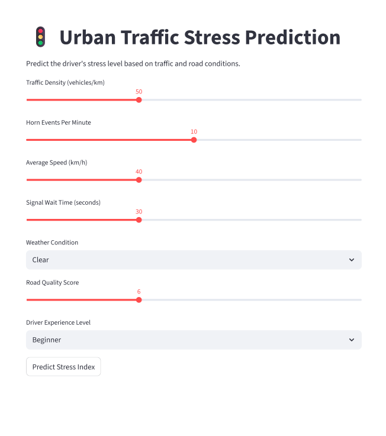
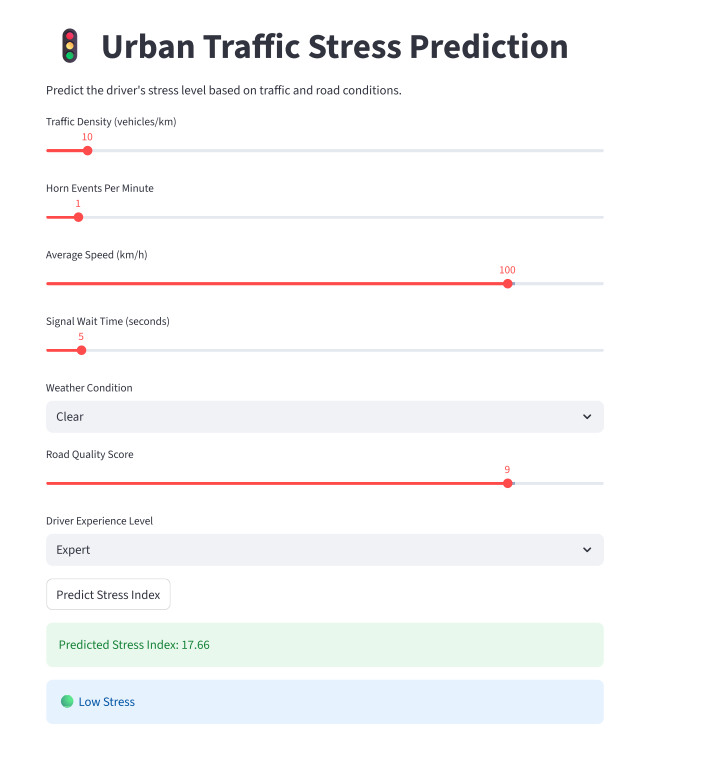
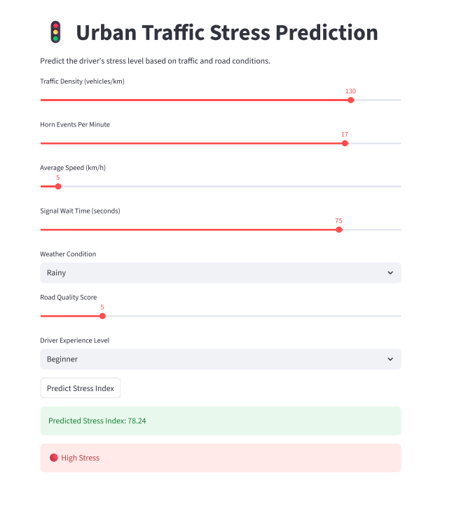

\# 🚦 Urban Traffic Stress Prediction Using Machine Learning


\## 📌 Project Overview


Urban traffic congestion can contribute to increased stress for drivers. This project uses machine learning to predict traffic-related stress levels based on traffic conditions, environmental factors, road quality, and driver experience.


A machine learning model was developed and deployed using \*\*Streamlit\*\*, allowing users to enter traffic conditions and receive a predicted stress level.


\## 🎯 Objective


The main objective of this project is to build a machine learning model that can predict an urban traffic stress index from different traffic and environmental features.


\## 📊 Dataset


The dataset contains approximately 50,000 traffic-related records.


\### Features


\* Traffic Density

\* Horn Events per Minute

\* Average Speed

\* Signal Wait Time

\* Weather Condition

\* Road Quality Score

\* Driver Experience Level


\### Target


\* \*\*Stress Index\*\*


\## 🔧 Technologies Used


\* Python

\* Pandas

\* NumPy

\* Matplotlib

\* Seaborn

\* Scikit-learn

\* Joblib

\* Streamlit

\* Jupyter Notebook


\## ⚙️ Machine Learning Workflow


The project follows these main steps:


1\. Data loading

2\. Data cleaning

3\. Exploratory Data Analysis (EDA)

4\. Handling categorical variables

5\. Outlier detection using IQR

6\. Feature scaling using StandardScaler

7\. Train-test split

8\. Model training

9\. Model comparison

10\. Model evaluation

11\. Model serialization

12\. Streamlit deployment


\## 🤖 Model


Several machine learning approaches were evaluated during the project.


The \*\*Support Vector Regression (SVR)\*\* model provided the best performance among the models evaluated and was selected for the final prediction application.


The trained model, scaler, and categorical encoders are stored in the `models/` directory.


\## 🌐 Streamlit Application


The project includes an interactive Streamlit application where users can enter:


\* Traffic density

\* Horn events per minute

\* Average speed

\* Signal wait time

\* Road quality

\* Weather condition

\* Driver experience level


The application then predicts the corresponding traffic stress index and displays the stress level.


\## 📁 Project Structure


```text

Traffic Stress Prediction/

│

├── app.py

├── urbantrafficstressprediction.ipynb

├── predicting urban traffic stress.pptx

├── requirements.txt

├── README.md

├── .gitignore

│

├── data/

│   └── smartcity trafficstress dataset.csv

│

├── models/

│   ├── traffic\_stress.pkl

│   ├── svr\_scaler.pkl

│   ├── le1.pkl

│   └── le2.pkl

│

└── images/

```


\## 🚀 How to Run the Project Locally


\### 1. Clone the repository


```bash

git clone <your-github-repository-url>

```


\### 2. Navigate to the project folder


```bash

cd Traffic-Stress-Prediction

```


\### 3. Install the required dependencies


```bash

pip install -r requirements.txt

```


\### 4. Run the Streamlit application


```bash

streamlit run app.py

```


The application will open in your browser.


\## 💡 Key Learning Outcomes


Through this project, I gained practical experience in:


\* Data preprocessing

\* Exploratory data analysis

\* Feature encoding

\* Outlier handling

\* Feature scaling

\* Regression model comparison

\* Model serialization using Joblib

\* Building an interactive ML application with Streamlit


\## 👩‍💻 Author


\*\*Janushree S\*\*


MSc Statistics | Data Science


Interested in Data Analytics, Data Science, Machine Learning, and Business Intelligence.


## 📸 Application Screenshots






